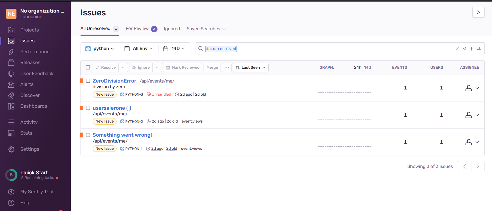
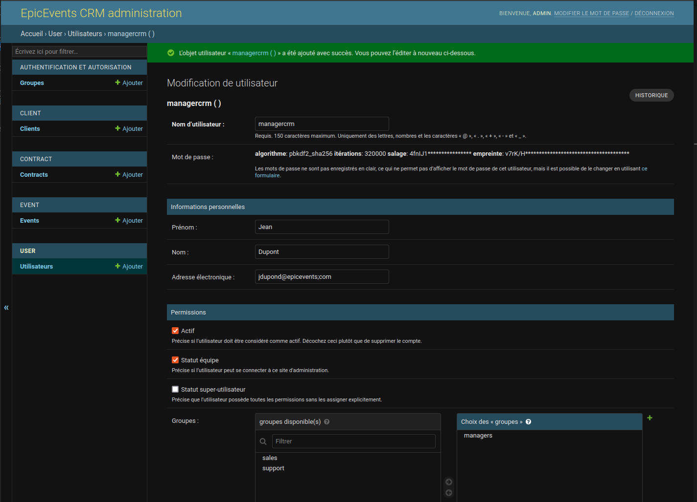
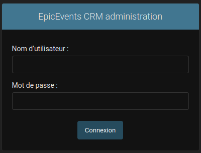
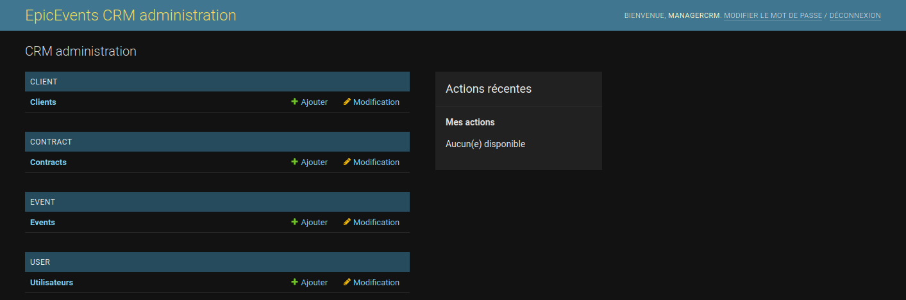
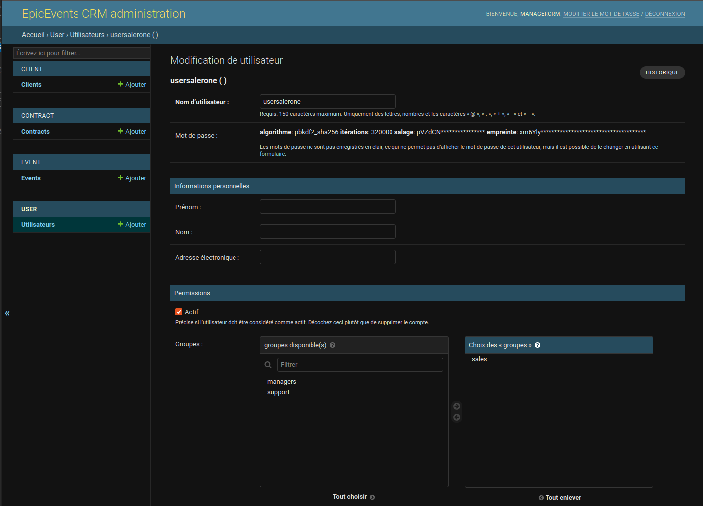

<style>
img
{
    display:block; 
    float:none; 
    margin-left:auto;
    margin-right:auto;
}
</style> 

# DA_Python_P12 - Développez une architecture back-end sécurisée en utilisant Django ORM

Développez une architecture back-end sécurisée en utilisant Django ORM

# Table des matières<a name="Table_of_Contents"></a>
- [DA_Python_P12 - Développez une architecture back-end sécurisée en utilisant Django ORM](#da_python_p12---développez-une-architecture-back-end-sécurisée-en-utilisant-django-orm)
- [Table des matières<a name="Table_of_Contents"></a>](#table-des-matières)
  - [INTRODUCTION <a name="INTRODUCTION"></a>](#introduction-)
  - [Objectifs du projet <a name="objectifs"></a>](#objectifs-du-projet-)
  - [FEATURES <a name="FEATURES"></a>](#features-)
  - [REQUIREMENTS <a name="REQUIREMENTS"></a>](#requirements-)
    - [Récupération du projet <a name="Recup_projet"></a>](#récupération-du-projet-)
    - [Création d'un environnement virtuel Python <a name="Env_Virtuel_Python"></a>](#création-dun-environnement-virtuel-python-)
    - [Installation des packages Python nécessaire <a name="Installation_package"></a>](#installation-des-packages-python-nécessaire-)
  - [Création de la base de données <a name="create_db"></a>](#création-de-la-base-de-données-)
  - [Lancement du serveur web  <a name="Validateur_HTML_no_charged"></a>](#lancement-du-serveur-web--)
  - [Documentation de l'API <a name="doc_api"></a>](#documentation-de-lapi-)
  - [Arborescence du projet <a name="Tree_project"></a>](#arborescence-du-projet-)
  - [Base de donnée <a name="Base_de_données"></a>](#base-de-donnée-)
    - [Installation de PostgreSQL](#installation-de-postgresql)
    - [Création de l'utilisateur "admindbcrm" dans PostgreSQL](#création-de-lutilisateur-admindbcrm-dans-postgresql)
    - [Création de la base de données "crm"](#création-de-la-base-de-données-crm)
    - [Rajout de la configuration de la base de données dans Django](#rajout-de-la-configuration-de-la-base-de-données-dans-django)
    - [Package pour la prise en charge de PostgreSQL](#package-pour-la-prise-en-charge-de-postgresql)
  - [Journalisation et surveillance de l'application <a name="log_surveillance"></a>](#journalisation-et-surveillance-de-lapplication-)
    - [Journalisation](#journalisation)
    - [Surveillance](#surveillance)
  - [API](#api)
    - [Les endpoints](#les-endpoints)
      - [Authentification JWT](#authentification-jwt)
      - [Clients](#clients)
      - [Contrats](#contrats)
      - [Evénements](#evénements)
    - [Filtres, recherche et tri](#filtres-recherche-et-tri)
    - [Documentation de l'API](#documentation-de-lapi)
  - [Interface d'administration du CRM](#interface-dadministration-du-crm)
    - [Url de la console d'administration du CRM](#url-de-la-console-dadministration-du-crm)
    - [Création d'un utilisateur avec un profile "manager"](#création-dun-utilisateur-avec-un-profile-manager)
    - [Se connecter avec un profile "manager"](#se-connecter-avec-un-profile-manager)
    - [Création d'un utilisateur de l'équipe vendeur ou support](#création-dun-utilisateur-de-léquipe-vendeur-ou-support)
  - [Contact <a name="Contact"></a>](#contact-)


## INTRODUCTION <a name="INTRODUCTION"></a>

Epic Events est une entreprise de conseil et de gestion dans l'événementiel qui répond aux besoins des start-up voulant organiser des « fêtes épiques ».

L'entreprise est très appréciée pour les fêtes et les événements hors du commun qu'elle organise pour ses clients de renom.


## Objectifs du projet <a name="objectifs"></a>

Elaborer un système CRM sécurisé interne à l'entreprise pour rassurer les clients en termes de sécurité.
L'application sera développée à l’aide Django avec une base de données PostgreSQL.

L'application Django doit fournir un ensemble d’endpoints sécurisés pour l’API à l'aide du framework Django REST (avec une base de données PostgreSQL) pour permettre les opérations CRUD (créer, lire, mettre à jour et supprimer) appliquées aux divers objets CRM. 

Créer une interface front-end simple à l'aide du site d'administration Django, laquelle permettra aux utilisateurs autorisés de gérer l'application, d'accéder à l'ensemble des modèles et de vérifier la configuration de la base de données.


[<div align="center">[Table of Contents]</div>](#Table_of_Contents) 

## FEATURES <a name="FEATURES"></a>

  - Utilise Python 3
  - Utilise Django (version 3.0+)
  - La base de données PostgreSQL sera utilisée (version 12.0+)
  - Site d'administration Django configuré
  - La page de connexion du site d'administration Django est accessible
  - l'application prend en charge les modèles suivants:
    - Client
    - Contrat
    - Evénement
    - Utilisateurs
  - L'API prend en charge les opérations CRUD en fonction des modèles de base de donnée
  - L'API est sécurisée et gestion des droits
  - Les endpoints d'API permettent aux utilisateurs de rechercher et de filtrer les informations

  
[<div align="center">[Table of Contents]</div>](#Table_of_Contents)

## REQUIREMENTS <a name="REQUIREMENTS"></a>
  - Une version de Python doit être installée sur votre poste, au moins la version 3.8.8 est conseillée. 
  - Voici un wiki pour installer Python selon votre système d'exploitation : https://fr.wikihow.com/installer-Python

  - Il est recommander de récupérer le projet en utilisant "git clone" ou en téléchargeant directement le projet.
  - Une connexion internet fonctionnelle est nécessaire pour la partie installation.

** Dans cette documention, nous donnons les commandes pour un système d'exploitation Linux (fonctionne aussi pour Mac). Si vous êtes sous Windows, il faut adapter les commandes à votre OS.


### Récupération du projet <a name="Recup_projet"></a>

- Par téléchargement:
  
 lien de téléchargement : https://github.com/lahou-sys/DA_Python_P12/archive/refs/heads/master.zip

- Par "git clone":
  
```ssh
git clone https://github.com/lahou-sys/DA_Python_P12.git
```


[<div align="center">[Table of Contents]</div>](#Table_of_Contents) 


### Création d'un environnement virtuel Python <a name="Env_Virtuel_Python"></a>

Se positionner dans le dossier de votre choix et qui hébergera le projet Django.

Si le module python "venv" n'est pas installé sur votre système, il est nécessaire de l'installer comme ci-dessous :

  - Installation du module "venv"

```ssh

$ pip install venv

```

  - Création de l'environnement virtuel Python

```ssh

$ cd DA_Python_P12
$ python3 -m venv .venv

```

  - Activation de l'environnement virtuel Python

```ssh

$ source ./.venv/bin/activate

```

[<div align="center">[Table of Contents]</div>](#Table_of_Contents) 

### Installation des packages Python nécessaire <a name="Installation_package"></a>

l'installation de ces packages sont nécessaire pour la bonne éxécution du projet.

- asgiref==3.5.2
- backports.zoneinfo==0.2.1
- certifi==2022.5.18.1
- Django==4.0.4
- django-filter==21.1
- djangorestframework==3.13.1
- djangorestframework-simplejwt==5.2.0
- psycopg2==2.9.3
- PyJWT==2.4.0
- pytz==2022.1
- sentry-sdk==1.5.12
- sqlparse==0.4.2
- urllib3==1.26.9

    - Installation automatique des packages ( se positionner dans le dossier du projet "DA_Python_P12")

```ssh

$ pip install -r requirements.txt

```


[<div align="center">[Table of Contents]</div>](#Table_of_Contents) 

## Création de la base de données <a name="create_db"></a>

Se positionner dans le dossier de l'application récupérée sur Gihub ("DA_Python_P12").

```ssh

$ cd crm
$ python manage.py migrate

```

- Création du super utilisateur pour l'administration de Django

Se positionner dans le dossier de l'application récupérée sur Gihub ("DA_Python_P12").

```ssh

$ cd project
$ python manage.py createsuperuser

Nom d’utilisateur: admin
Adresse électronique: admin@epicevents.com
Password: 
Password (again): 
Superuser created successfully.

```

[<div align="center">[Table of Contents]</div>](#Table_of_Contents)


## Lancement du serveur web  <a name="Validateur_HTML_no_charged"></a>

Lançons le serveur de développement, démarrez-le comme ceci :

Se positionner dans le dossier de l'application récupérée sur Gihub ("DA_Python_P12").

```ssh

$ cd crm
$ python manage.py runserver

```

Exemple de sortie:

```ssh

Performing system checks...

System check identified no issues (0 silenced).
June 11, 2022 - 19:37:33
Django version 4.0.4, using settings 'crm.settings'
Starting development server at http://127.0.0.1:8000/
Quit the server with CONTROL-C.

```

[<div align="center">[Table of Contents]</div>](#Table_of_Contents)

## Documentation de l'API <a name="doc_api"></a>

Pour utiliser l'API, vous pouvez consulter la documentation de cette dernière sur l'URL suivant:

- https://documenter.getpostman.com/view/13028407/UyrAGHXd


[<div align="center">[Table of Contents]</div>](#Table_of_Contents)

## Arborescence du projet <a name="Tree_project"></a>

Voici l'arborescence du projet.

Arborescence générale du projet:

```ssh

├── crm
│   ├── base_admin
│   ├── client
│   ├── contract
│   ├── crm
│   ├── event
│   ├── log
│   ├── manage.py
│   └── user
├── README.md
└── requirements.txt

```

[<div align="center">[Table of Contents]</div>](#Table_of_Contents)

## Base de donnée <a name="Base_de_données"></a>

La base de données PostgreSQL (version 12) sera utilisée dans ce projet.

### Installation de PostgreSQL

Voici l'url pour installer PostgreSQL pour votre environnement :

- https://public.dalibo.com/exports/formation/manuels/modules/b/b.handout.html

Url documentation officielle :

- https://www.postgresql.org/docs/
  

### Création de l'utilisateur "admindbcrm" dans PostgreSQL

Se connecter au serveur hébergeant la base de données.

```ssh
$ sudo -i -u postgres

$ psql

postgres=# create user admindbcrm with encrypted password 'Password@2022';

postgres=# alter role admindbcrm set client_encoding to 'utf8';

postgres=# alter role admindbcrm set default_transaction_isolation to 'read committed';

postgres=# exit

$ exit

```

P.S.: Changer le mot de passe 'Password@2022' à votre convenance.

### Création de la base de données "crm"

```ssh
$ sudo -i -u postgres

$ psql

postgres=# create database crm;

postgres=# grant all privileges on database crm to admindbcrm;

postgres=# exit

$ exit

```

### Rajout de la configuration de la base de données dans Django

Se positionner dans le dossier de l'application récupérée sur Gihub ("DA_Python_P12").

```ssh

$ cd ./crm/crm

```

```ssh
./crm/crm
├── asgi.py
├── base_mixin.py
├── __init__.py
├── settings.py
├── urls.py
└── wsgi.py

```
La configuration de la base de données se trouve dans le fichier "settings.py".

```yaml
DATABASES = {
    'default': {
        'ENGINE': 'django.db.backends.postgresql_psycopg2',
        'NAME': 'crm',
        'USER': 'admindbcrm',
        'PASSWORD': 'Password@2022',
        'HOST': '127.0.0.1',
        'PORT': '5432',
    }
}
```

[<div align="center">[Table of Contents]</div>](#Table_of_Contents)

### Package pour la prise en charge de PostgreSQL

Activer l'enviroennement virtuel Python et installer le package "psycopg2"

Si vous avez installer les packages plus haut avec à l'aide du fichier "requirements.txt",vous n'avez pas besoin de faire cette étape.

```ssh

$ pip install psycopg2

```

[<div align="center">[Table of Contents]</div>](#Table_of_Contents)


## Journalisation et surveillance de l'application <a name="log_surveillance"></a>

### Journalisation

Les logs sont activés et écrés dans un fichier dans le dossier de l'application.
Le fichier log se nomme "crm.log", le niveau de log est configuré sur "Info".

Se positionner dans le dossier de l'application récupérée sur Gihub ("DA_Python_P12").

```ssh

$ cd ./crm/log

```

```ssh

./crm/log/
└── crm.log

```

Exemple de contenu :

```log
[...]
INFO 2022-06-09 20:19:52,339 basehttp 9141 140339541714688 "GET /api/events/ HTTP/1.1" 200 314
ERROR 2022-06-09 20:20:00,808 log 9141 140339541714688 Internal Server Error: /api/events/me/
Traceback (most recent call last):
  File "/home/lahou/DA-Python/P12/.venv/lib/python3.8/site-packages/django/core/handlers/exception.py", line 55, in inner
    response = get_response(request)
  File "/home/lahou/DA-Python/P12/.venv/lib/python3.8/site-packages/django/core/handlers/base.py", line 197, in _get_response
    response = wrapped_callback(request, *callback_args, **callback_kwargs)
  File "/home/lahou/DA-Python/P12/.venv/lib/python3.8/site-packages/sentry_sdk/integrations/django/views.py", line 67, in sentry_wrapped_callback
    return callback(request, *args, **kwargs)
  File "/home/lahou/DA-Python/P12/.venv/lib/python3.8/site-packages/django/views/decorators/csrf.py", line 54, in wrapped_view
    return view_func(*args, **kwargs)
  File "/home/lahou/DA-Python/P12/.venv/lib/python3.8/site-packages/rest_framework/viewsets.py", line 125, in view
    return self.dispatch(request, *args, **kwargs)
  File "/home/lahou/DA-Python/P12/.venv/lib/python3.8/site-packages/rest_framework/views.py", line 509, in dispatch
    response = self.handle_exception(exc)
  File "/home/lahou/DA-Python/P12/.venv/lib/python3.8/site-packages/rest_framework/views.py", line 469, in handle_exception
    self.raise_uncaught_exception(exc)
  File "/home/lahou/DA-Python/P12/.venv/lib/python3.8/site-packages/rest_framework/views.py", line 480, in raise_uncaught_exception
    raise exc
  File "/home/lahou/DA-Python/P12/.venv/lib/python3.8/site-packages/rest_framework/views.py", line 506, in dispatch
    response = handler(request, *args, **kwargs)
  File "/home/lahou/DA-Python/P12/crm/event/views.py", line 50, in me
    division_by_zero = 1 / 0
ZeroDivisionError: division by zero
ERROR 2022-06-09 20:20:00,831 basehttp 9141 140339541714688 "GET /api/events/me/ HTTP/1.1" 500 98664
INFO 2022-06-09 20:21:53,420 autoreload 9141 140339611572032 /home/lahou/DA-Python/P12/crm/event/views.py changed, reloading.
INFO 2022-06-09 20:21:54,637 autoreload 9252 139826029721408 Watching for file changes with StatReloader
WARNING 2022-06-09 20:24:03,372 log 9252 139825959864064 Unauthorized: /api/events/me/
WARNING 2022-06-09 20:24:03,383 basehttp 9252 139825959864064 "GET /api/events/me/ HTTP/1.1" 401 183
INFO 2022-06-09 20:24:09,260 basehttp 9252 139825864759040 "POST /auth-token/ HTTP/1.1" 200 483
INFO 2022-06-09 20:24:20,658 basehttp 9252 139825959864064 "GET /api/events/ HTTP/1.1" 200 314
WARNING 2022-06-09 20:33:26,563 log 9252 139825959864064 Unauthorized: /api/events/
WARNING 2022-06-09 20:33:26,569 basehttp 9252 139825959864064 "GET /api/events/?sort_by=-event_date HTTP/1.1" 401 183
INFO 2022-06-09 20:33:34,853 basehttp 9252 139825864759040 "POST /auth-token/ HTTP/1.1" 200 483
INFO 2022-06-09 20:33:41,018 basehttp 9252 139825959864064 "GET /api/events/?sort_by=-event_date HTTP/1.1" 200 314
WARNING 2022-06-10 18:15:14,117 log 9252 139825856366336 Not Found: /event/
WARNING 2022-06-10 18:15:14,228 basehttp 9252 139825856366336 "GET /event/ HTTP/1.1" 404 2794
INFO 2022-06-11 19:37:32,797 autoreload 5341 140352678659904 Watching for file changes with StatReloader
[...]
```
P.S.: les erreurs présentes dans l'example ci-dessus sont provoqués volontairement

[<div align="center">[Table of Contents]</div>](#Table_of_Contents)

### Surveillance

Pour la surveillance de l'application, "Sentry" est utilisé.

Sentry propose un suivi des erreurs en open source pour surveiller et corriger les bugs et les plantages partout dans votre application, en temps réel.

Sentry regroupe et ajoute un contexte important pour compiler les traces et vous indique les utilisateurs, les services et les serveurs affectés.

La configuration se fait dans le fichier "settings.py".

Copie d'écran de l'interface Web de Sentry:



Vous pouvez voir l'erreur "ZeroDivisionError" que nous avons provoqué volontairement.
Cette erreur est aussi observable dans le fichier les traces du fichier de logs plus haut.

[<div align="center">[Table of Contents]</div>](#Table_of_Contents)


## API

L'API est accessible via l'adress suivant :

- http://localhost:8000/api/

### Les endpoints

#### Authentification JWT

- Demande d'un jeux de jeton d'accès et de jeton de "refresh" :

  - http://localhost:8000/api/auth-token/
    
    - Méthode authorisée : POST 


- Demande de refresh du jeton d'accès

  - http://localhost:8000/api/refresh/

    - Méthode authorisée : POST


- Demande de déconnexion (révoque uniquement le jeton de "refresh"):

  - http://localhost:8000/api/logout/
    
    - Méthode authorisée : POST

[<div align="center">[Table of Contents]</div>](#Table_of_Contents)

#### Clients

- Demande de la liste de tous les clients :
  
  - http://localhost:8000/api/clients/

    - Méthode authorisée : GET


- Demande de la liste de tous les clients attribués à l'utilisateur connecté s'il est fait partie de l'équipe des vendeurs :
  
  - http://localhost:8000/api/clients/me

    - Méthode authorisée : GET


- Demande de la liste de tous les clients qui sont encore en prospection:

  - http://localhost:8000/api/clients/prospects

    - Méthode authorisée : GET


- Demande de détails sur client, il est possible aussi de modifier ou supprimer un client:
  
  - http://localhost:8000/api/clients/{pk}/

    - Méthodes authorisées : GET, PUT, PATCH, DELETE


- Demande la liste des contrats rattachés à un client ou rajoute un contrat à un client:

  - http://localhost:8000/api/clients/{pk}/contracts/

    - Méthodes authorisées : # GET, POST

 
 P.S.: "pk" est l'identifiant unique du client

[<div align="center">[Table of Contents]</div>](#Table_of_Contents)

#### Contrats

- Demande de la liste de tous les contrats :

  - http://localhost:8000/api/contracts/
  
    - Méthode authorisée : GET


- Demande de la liste de tous les contrats attribués à l'utilisateur connecté s'il est fait partie de l'équipe des vendeurs :

  - http://localhost:8000/api/contracts/me
  
    - Méthode authorisée : GET


- Demande de détails sur un contrat, il est possible aussi de modifier ou supprimer un contrat:

  - http://localhost:8000/api/contracts/{pk}/
  
    - Méthodes authorisées : GET, PUT, PATCH, DELETE


- Demande la liste des événements rattachés à un contrats ou rajoute un événement à un contrats:

  - http://localhost:8000/api/contracts/{pk}/events/

    - Méthodes authorisées : GET, POST


 P.S.: "pk" est l'identifiant unique du contrat.

[<div align="center">[Table of Contents]</div>](#Table_of_Contents)

#### Evénements

- Demande de la liste de tous les événements:
  
  - http://localhost:8000/api/events/
  
    - Méthode authorisée : GET

- Demande de la liste de tous les événements attribués à l'utilisateur connecté s'il est fait partie de l'équipe du support :
  
  - http://localhost:8000/api/events/me

    - Méthode authorisée : GET

- Demande de détails sur un événement, il est possible aussi de modifier ou supprimer un événement:

- http://localhost:8000/api/events/{pk}/

    - Méthodes authorisées : GET, PUT, PATCH, DELETE


 P.S.: "pk" est l'identifiant unique de l'événement.

[<div align="center">[Table of Contents]</div>](#Table_of_Contents)

### Filtres, recherche et tri

Il est aussi possible de réaliser des filtres et des recherches au niveau des Endpoints de l'API. De même, il est possible de trier par rapport à certaines informations.

Il est bien sûre possible de cumuler les filtres et la recherche au sein d'un seul appel API.

Pour plus de détails, merci de consulter la documentation de l'API indiquée ci-dessus.

[<div align="center">[Table of Contents]</div>](#Table_of_Contents)

### Documentation de l'API

Pour plus de détails, la documentation est disponible à l'url suivant :

Url doc API :

- https://


[<div align="center">[Table of Contents]</div>](#Table_of_Contents)

## Interface d'administration du CRM

Seul les utilisateurs présents dans le groupe des "managers" (équipe de gestion) sont authorisés à se connecter à l'interface de d'administration du CRM.

### Url de la console d'administration du CRM

Url de l'interface d'administration du CRM:

- http://localhost:8000/crm-admin/

### Création d'un utilisateur avec un profile "manager"

    1- Se connecter à l'interface d'administration avec le compte du  super utilisateur (admin) créé plus haut.

    2- Cliquer sur "Ajouter" à côté de "utilisateurs" (voir copie d'écran)

    3- Renseigner les champs comme "username", "password" et l'identité de l'utilisateur

    4- Cocher la case "statut équipe"

    5- Rajouter le groupe "managers" dans le champs "choix des groups" (voir la copie d'écran)

Copie d'écran (connection avec le super utlisateur):



[<div align="center">[Table of Contents]</div>](#Table_of_Contents)

### Se connecter avec un profile "manager"

Url de l'interface d'administration du CRM:

- http://localhost:8000/crm-admin/



Rentrer les informations pour vous connecter.

Copie d'écran de l'interface d'administration avec un profile manager :



[<div align="center">[Table of Contents]</div>](#Table_of_Contents)

### Création d'un utilisateur de l'équipe vendeur ou support

Pour créer un utilisateur de l'équipe vendeur ou support, vous devez vous connecter avec un utilisateur ayant un profil manager sur la console d'administration du CRM comme indiqué plus haut.

    1- Se connecter à l'interface d'administration avec un compte de manager créé plus haut.

    2- Cliquer sur "Ajouter" à côté de "utilisateurs" (voir copie d'écran)

    3- Renseigner les champs comme "username", "password" et l'identité de l'utilisateur

    5- Pour un vendeur; rajouter le groupe "sales" dans le champs "choix des groups" (voir la copie d'écran).

    6- Pour un utilisateur de l'équipe support; rajouter le groupe "support" dans le champs "choix des groups".

Copie d'écran pour un vendeur:



[<div align="center">[Table of Contents]</div>](#Table_of_Contents)

## Contact <a name="Contact"></a>

Mail : lbenmoulay@gmail.com


